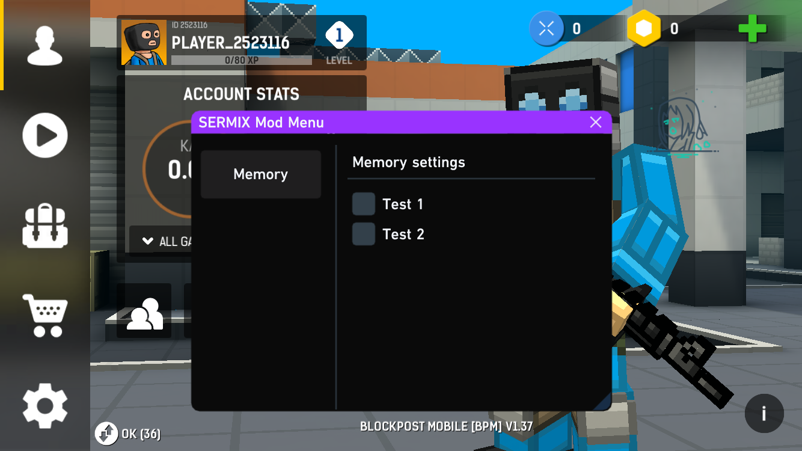

# SERMIX MOD MENU



## HOW TO USE
- Use 3 finger gesture to close the mod menu icon -
- Use 2 finger gesture like the mod menu icon -
- Provide customized user interface (UI) -
- Support multi-touch control

## TOOLS
1. `google cloud shell` [ggcs](https://shell.cloud.google.com/?pli=1&show=ide%2Cterminal)
2. `theos` [theos-for-google-cloud-shell](https://theos.dev/docs/installation-linux)
3. `sdk ios` [this](https://github.com/xybp888/iOS-SDKs) `or` [this](https://github.com/theos/sdks)

## INSTALL
1. `go to google shell` and input
```
apt install bash curl
```
2. `input theos bash`
```
 bash -c "$(curl -fsSL https://raw.githubusercontent.com/theos/theos/master/bin/install-theos)"
```
3. `go to templates in theos`
   ```
   cd theos/vendor/templates
   ```
4. `wget your project .nic.tar dont unzip`
```
wget https://github.com/raw/your-nic.tar
```
5. `go to main google shell`
   ```
   cd
   $THEOS/bin/nic.pl
   ```
   

## MORE IMG


## CREDIT 
- `batch` [batchh-mod-menu-template](https://iosgods.com/topic/182814-theos-batchh-mod-menu-template-162-il2cpp-imgui/)
- `HuyJIt` [HuyJIT](https://github.com/34306/HuyJIT-ModMenu)
- `joeyjurjens` [joeyjurjens](https://github.com/joeyjurjens/iOS-Mod-Menu-Template-for-Theos)
- `and me fix support gesture 沈`

